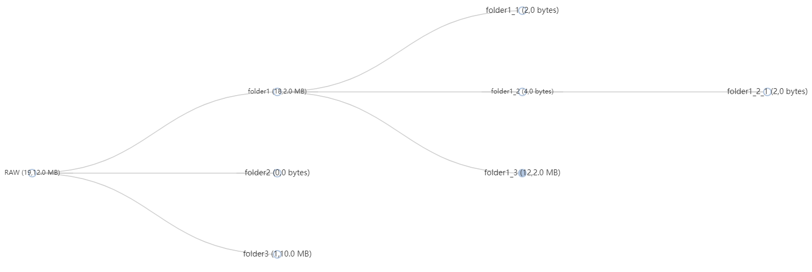

### Directory Tree

A tool that can generate a tree view, including the number and size of files in subdirectories, for a given set of directories. Shown as below:



### Usage

```
python dirtree.py --rawpaths ./inputs/test1/;./inputs/test2/ --output ./outputs/render.html
```

Note: ```rawpaths``` accept multiple directories separated by semicolons
